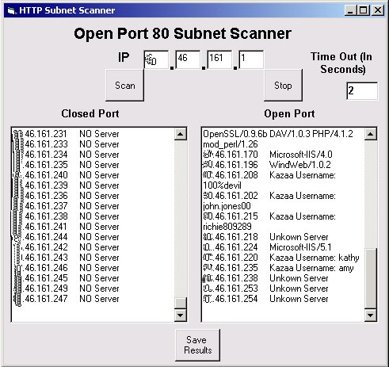



## Open HTTP Scanner V2

### Description

Scans whole subnets for open port 80 using multiple winsock connections (array/threads), once found it finds out the server running (eg IIS/apache) and what version, if no server is found, it tries to find out the kazaa username. Can now scan subnets in under 2 minutes (on dsl). Fully Documented, uses Inet controls (internet Transfer Control), and Winsock.
 
### More Info
 

             |
---                |---
**Submitted On**   |2003-02-06 17:18:34
**By**             |[Peter Rowan](https://github.com/Planet-Source-Code/PSCIndex/blob/master/ByAuthor/peter-rowan.md)
**Level**          |Intermediate
**User Rating**    |3.7 (11 globes from 3 users)
**Compatibility**  |VB 6\.0
**Category**       |[Internet/ HTML](https://github.com/Planet-Source-Code/PSCIndex/blob/master/ByCategory/internet-html__1-34.md)
**World**          |[Visual Basic](https://github.com/Planet-Source-Code/PSCIndex/blob/master/ByWorld/visual-basic.md)
**Archive File**   |[Open\_HTTP\_1542402102003\.zip](https://github.com/Planet-Source-Code/peter-rowan-open-http-scanner-v2__1-43122/archive/master.zip)

